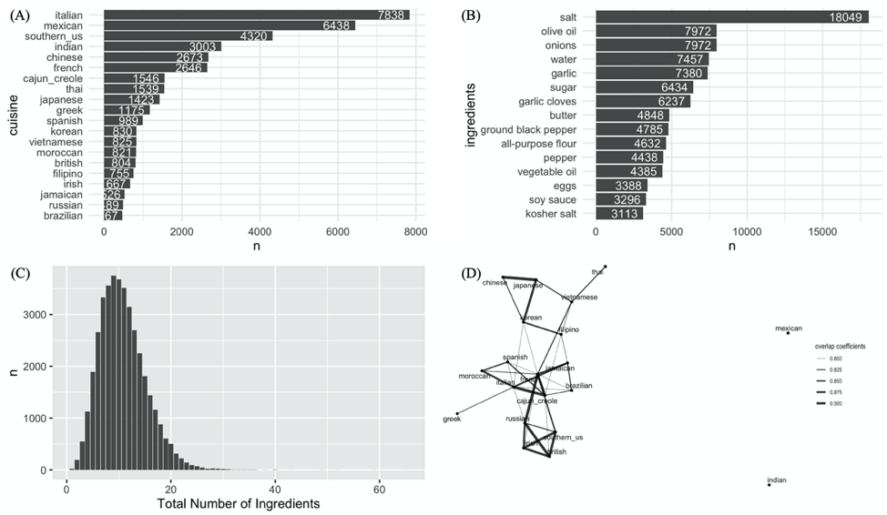

```{r setup, include = FALSE}

```

<link rel="stylesheet" href="style.css">
<script src="https://kit.fontawesome.com/6e8b08f469.js" crossorigin="anonymous"></script>

<h2><b> Welcome! </b></h2>


My name is Georgen Wu, I'm currently a M.S. candidate in biostatistics at Columbia University. I graduated from Shanghai Jiao Tong University with a B.S. degree in bioinformatics.

I'm passionate to deal with big data and work with data experts. Seeking to gain practical experience and job position in data analysis, data engineer, data science and machine learning.

<br>

<center>
<h2><b> Highlight Projects </b></h2> 
<h4><a href="experiences.html"> detail and more </a></h4>

<table>
<col width="12%">
<col width="38%">
<col width="15%">
<col width="35%">

<tr style="border-top:1pt solid black; border-bottom:1pt solid #D3D3D3;">
  <td style="vertical-align: middle"></td>
  <td><b>Movie Recommendation System</b> 
  <br>
  Built a movie recommendation app using association rule and Single Value Decomposition on Google Cloud Platform.
  </td>
  
  <td style="vertical-align: middle"></td>
  <td><b>Cooking Recipe Cuisine Type Prediction</b>
  <br>
  Built a cuisine type prediction model using feature extraction and four classification models.
  </td>
</tr>

<tr style="border-bottom:1pt solid black;">
  <td style="vertical-align: middle"></td>
  <td><b>Predictive Model For Down Syndrome Disease</b> 
  <br>
  Built a predictive model to identify significant proteins, compared between Path-wise Coordinate Descent and Smoothed Bootstrap.
  </td>
  
  <td style="vertical-align: middle"></td>
  <td><b>Model Selection For Better Cancer Diagnose</b>
  <br>
  Performed different model selection strategies to identify 'best' covariates.
  </td>
</tr>
</table>

</center>


<center>

<h2><b> Contact </b></h2>

Here is my <a href="resume.html">resume</a> in case you are the big boss or HR :)

<h2>
<a class="fas fa-envelope" href="wu459201296@gmail.com"> </a>
<a class="fab fa-github" href="http://github.com/valuntiny/"> </a>
<a class="fab fa-linkedin" href="https://www.linkedin.com/in/guojing-wu-213795146/"> </a></h2>

</center>


