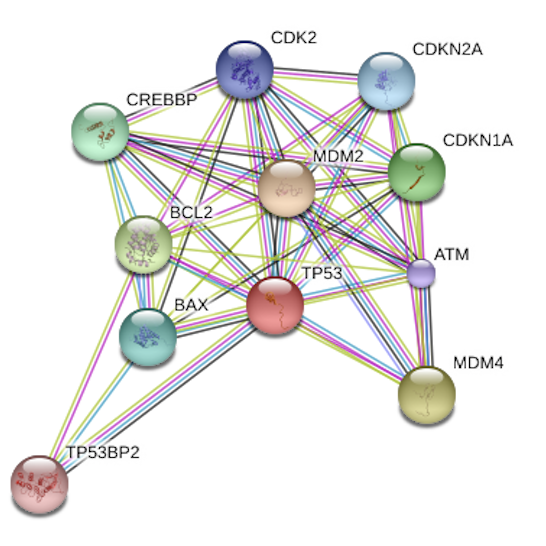

```{r setup, include = FALSE}

```

<link rel="stylesheet" href="style.css">
<script src="https://kit.fontawesome.com/6e8b08f469.js" crossorigin="anonymous"></script>

<h2><b> Welcome! </b></h2>


My name is Georgen Wu, I'm currently a M.S. candidate in biostatistics at Columbia University. I graduated from Shanghai Jiao Tong University with a B.S. degree in bioinformatics.

I'm passionate to deal with big data and work with data experts. Seeking to gain practical experience and job position in data analysis, data engineer, data science and machine learning.

<br>

<center>
<h2><b> Highlight Projects </b></h2> 

<table>
<col width="20%">
<col width="30%">
<col width="50%">

<tr style="border-top:1pt solid black;">
  <th rowspan="3"><a href="https://github.com/Sapphirine/201912-43-Movie-Recommendation"></a></th>
  <td style="vertical-align: bottom"><font color="8B8A8A">Nov 2019 - Dec 2019</font></td>
  <td style="text-align:right; vertical-align:bottom"><font color="8B8A8A">Columbia University</font></td>
</tr>
<tr>
  <td colspan="2" style="height:20px; vertical-align:middle"><h3><b>Movie Recommendation System</b></h3></td>
</tr>
<tr>
  <td colspan="2">
  * Collected movie information and user rating data from IMDB, TMDB and GroupLens, and loaded them into Google BigQuery using SQL.
  
  * Ran exploratory data analysis by R, gave insight into the data.
  
  * Performed ssociation rule and Single Value Decomposition methods by PySpark, give out personalized recommended movies.
  
  * Used HTML, Django and SVG to build a graphical user interface system, and deployed it on Google App Engine.</td>
</tr>

<tr style="border-top:1pt solid black;">
  <th rowspan="3"><a href="https://github.com/valuntiny/P9120_final"></a></th>
  <td style="vertical-align: bottom"><font color="8B8A8A">Nov 2019 - Dec 2019</font></td>
  <td style="text-align:right; vertical-align:bottom"><font color="8B8A8A">Columbia University</font></td>
</tr>
<tr>
  <td colspan="2" style="height:20px; vertical-align:middle"><h3><b>Cooking Recipe Cuisine Type Prediction</b></h3></td>
</tr>
<tr>
  <td colspan="2">
  * Collected cooking recipe data from Kaggle and performed exploratory data analysis by R, reveal the difference between each cuisine type.
  
  * Used 'Tokenizer' to break list ingredients into individual words, then compared two feature extraction methods 'Word2Vec' and 'TF-IDF', found out 'TF-IDF' is better in capturing the hidden feature.
  
  * Compared four machine learning methods SVM, logistic regression, decision tree and random forest by using `Pyspark`, and found out logistic regression gives the highest prediction accuracy. </td>
</tr>

<tr style="border-top:1pt solid black;">
  <th rowspan="3"><a href="https://github.com/valuntiny/E6893_HW3"></a></th>
  <td style="vertical-align: bottom"><font color="8B8A8A">Oct 2019 - Oct 2019</font></td>
  <td style="text-align:right; vertical-align:bottom"><font color="8B8A8A">Columbia University</font></td>
</tr>
<tr>
  <td colspan="2" style="height:20px; vertical-align:middle"><h3><b>Twitter Steaming Data Analysis</b></h3></td>
</tr>
<tr>
  <td colspan="2">
  * Used `PySpark` and TCP protocol to capture twitter streaming data for 10 minutes through API, and loaded the result into Google BigQuery.
  
  * Used SQL, Django and SVG to build a interactive website gadget to visualize the exploratory analysis.</td>
</tr>

<tr style="border-top:1pt solid black;">
  <th rowspan="3"><a href="https://github.com/valuntiny/p8160_group_project_2"></a></th>
  <td style="vertical-align: bottom"><font color="8B8A8A">Mar 2019 - Apr 2019</font></td>
  <td style="text-align:right; vertical-align:bottom"><font color="8B8A8A">Columbia University</font></td>
</tr>
<tr>
  <td colspan="2" style="height:20px; vertical-align:middle"><h3><b>Predictive Model For Down Syndrome Disease</b></h3></td>
</tr>
<tr>
  <td colspan="2">
  * Used R to build a predictive model based on logistic regression to facilicate down syndrome diagnosis.
  
  * Compared methods including and Pathwise Coordinate Descent with regularized logistic regression and smoothed bootstrap estimation, found out that Smoothed Bootstrap Estimation provides a more accurate classification result.
  
  * Identified a subset of proteins that are significantly associated with Down syndrome using the best method.</td>
</tr>

<tr class="spacer"></tr>

<tr style="border-top:1pt solid black;">
  <th rowspan="3"><a href="https://github.com/Raarbiarsan1899/p8130_bm_group4"></a></th>
  <td style="vertical-align: bottom"><font color="8B8A8A">Dec 2018 - Dec 2018</font></td>
  <td style="text-align:right; vertical-align:bottom"><font color="8B8A8A">Columbia University</font></td>
</tr>
<tr>
  <td colspan="2" style="height:20px; vertical-align:middle"><h3><b>Model Selection For Better Cancer Diagnose</b></h3></td>
</tr>
<tr>
  <td colspan="2">
  * Collected the cancer statistics dataset containing information from cancer.gov, census.gov and clinicaltrials.gov, performed different model selection strategies like forward selection, backward selection and LASSO with cross validation in R, selected a set of predictors that ‘best’ predicts cancer mortality.</td>
</tr>

<tr style="border-top:1pt solid black;">
  <th rowspan="3"><a href="http://shanj.tk/P8105_final_website.io/index.html"></a></th>
  <td style="vertical-align: bottom"><font color="8B8A8A">Nov 2018 - Dec 2018</font></td>
  <td style="text-align:right; vertical-align:bottom"><font color="8B8A8A">Columbia University</font></td>
</tr>
<tr>
  <td colspan="2" style="height:20px; vertical-align:middle"><h3><b>Data Science Job Marketing Analysis</b></h3></td>
</tr>
<tr>
  <td colspan="2">
  * Launched exploration from a general trend finding through data from National Occupational Employment Status and Wage Estimates from the US Bureau of Labour Statistics. Found out most required skills and background majors for data-related jobs, and the difference in qualification between Fortune 500 and non-Fortune 500 companies. 
  
  * Used `shiny` and `flexdashboard` R package to create Dashboard and multiple visualization tools to represent our findings.</td>
</tr>

<tr style="border-top:1pt solid black;">
  <th rowspan="3"><a href="https://github.com/valuntiny/p8105_mtp_gw2383"></a></th>
  <td style="vertical-align: bottom"><font color="8B8A8A">Oct 2018 - Oct 2018</font></td>
  <td style="text-align:right; vertical-align:bottom"><font color="8B8A8A">Columbia University</font></td>
</tr>
<tr>
  <td colspan="2" style="height:20px; vertical-align:middle"><h3><b>Congestive Heart Failure Profile Analysis</b></h3></td>
</tr>
<tr>
  <td colspan="2">
  * Launched exploratory data analysis to study the patient's profile, found out basic pattern of his activity.
  
  * Applied linear regression and ANOVA on the activity data by using R. Found out the patterns of physical activity over long periods of time and helped to improve dynamic update of patient status.</td>
</tr>

<tr style="border-top:1pt solid black;">
  <th rowspan="3"><a href="https://github.com/valuntiny/valuntiny.github.io/blob/master/thesis_final_version.pdf"></a></th>
  <td style="vertical-align: bottom"><font color="8B8A8A">Dec 2015 - May 2017</font></td>
  <td style="text-align:right; vertical-align:bottom"><font color="8B8A8A">Shanghai Jiao Tong University</font></td>
</tr>
<tr>
  <td colspan="2" style="height:20px; vertical-align:middle"> <h3><b> Assessment of Zero-Inflated Model </b></h3>
  </td>
</tr>
<tr>
  <td colspan="2">
  * Proposed a biological network module-based zero-augmented generalized linear model for differential expression analysis. 
  
  * Conducted two simulation studies by using parallel computing on cluster to compare the efficacy between zero-inflated model, hurdle model and negative binomial model, found out zero-inflated Poisson model gave out best performance.
  
  * Applied models to CPTAC colorectal cancer data set, and identified subtler protein pathways and modules that can not been detected by normal model.</td>
</tr>

</table>

</center>

</br>
</br>
</br>

<center>

<h2><b> Contact </b></h2>

Here is my <a href="resume.html">resume</a> in case you are the big boss or HR :)

<h2>
<a class="fas fa-envelope" href="wu459201296@gmail.com"> </a>
<a class="fab fa-github" href="http://github.com/valuntiny/"> </a>
<a class="fab fa-linkedin" href="https://www.linkedin.com/in/guojing-wu-213795146/"> </a></h2>

</center>


